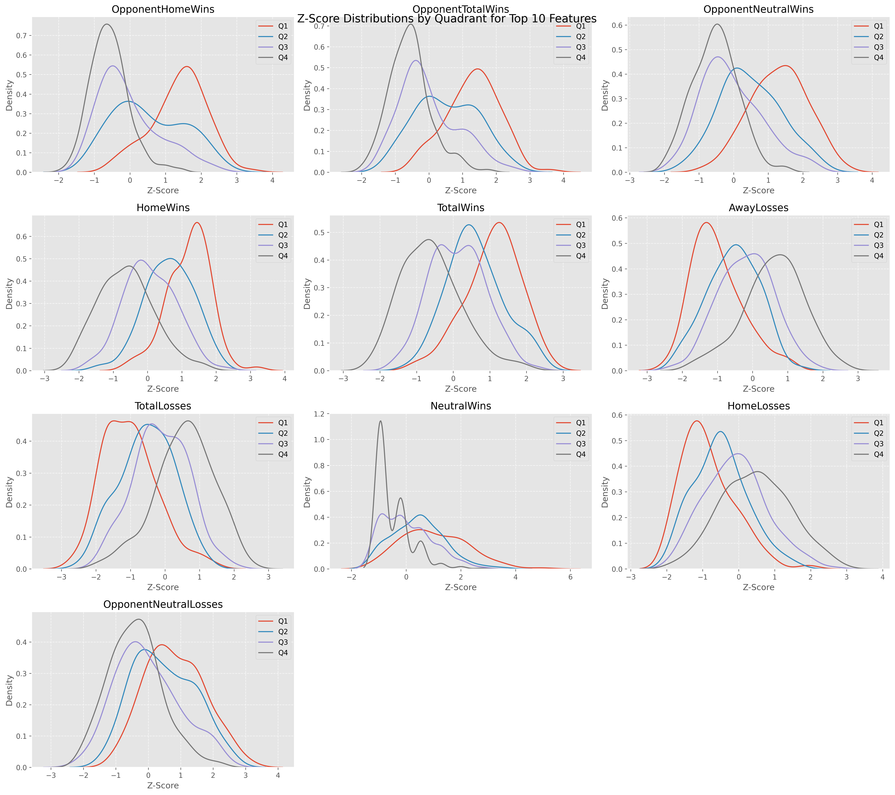

# Project layout

```
.
├── archives/                    # ZIP archives and snapshots
├── data/
│   ├── raw/                     # Source inputs by season/gender (Scraping/, WBB_Data/, rankings, teams, select_sun, season CSVs)
│   └── processed/               # Combined/cleaned datasets ready for modeling (ncaa_data_all*)
├── docs/                        # Supporting documents (A10 Work.pdf)
├── models/                      # Saved model artifacts and data splits (*.joblib)
├── notebooks/                   # Analysis, scraping, and modeling notebooks (incl. deep learning)
├── reports/
│   ├── figures/                 # Visual assets and dashboards (root PNGs + Visualizations/)
│   ├── outputs/                 # Prediction CSVs and test outputs
│   └── Deep Learning Results/   # DL-specific plots and predictions
└── src/                         # Python scripts (ncaa-basketball-analysis.py)
```

Notes
- Raw data is grouped under `data/raw` by source/season; processed datasets live in `data/processed`.
- Visuals are consolidated under `reports/figures`; model outputs under `reports/outputs`.
- Serialized models are in `models/`; notebooks live in `notebooks/` (deep learning work kept under `notebooks/deep learning/`).

## Running the notebooks

### Data sources

- **Game and team data:** Massey Ratings (all Division I men's and women's games/teams). The raw Massey downloads live under `data/raw/`.
- **Ranking data:** An older version of the NCAA NET rankings pages accessed via the Internet Archive for the specific season. Rankings are captured right before Selection Sunday (e.g., the 2025 rankings snapshot is taken just before 2025 Selection Sunday) to avoid contaminating the dataset with tournament results.

### Prerequisites

Install Python 3.10+ and the packages commonly used across the notebooks:

```
pip install jupyterlab pandas numpy matplotlib seaborn scikit-learn xgboost lightgbm catboost joblib
pip install torch torchvision torchaudio  # only required for deep learning notebooks
```

If you plan to re-run scraping notebooks, you may also need:

```
pip install requests beautifulsoup4 lxml
```

### Recommended execution order

The notebooks build on each other. If you start from raw data, run them in this order:

1. **Scrape and assemble raw sources**
   - Run `scrape_ncaa_games` first. It processes the Massey files and scrapes the NCAA NET ranking URLs (via the Internet Archive).
   - This step produces the season-level inputs used for merges downstream.
2. **Merge rankings with stats**
   - Run `rankings_stats_table_merge`.
   - Manually match team names between the stats tables and ranking tables so the merge succeeds (this is required for every season).
3. **Set quadrant rankings (per year)**
   - After the merge, set the quadrant rankings for that season.
   - Repeat the merge + quadrant-setting process for each year you want to include.
4. **Build the final classification table**
   - Use the final merged, multi-year table from `rankings_stats_table_merge` as input for classification.
   - From here, run any modeling notebooks you prefer (classical ML or deep learning).
5. **Visualization & reporting**
   - Notebooks that read predictions or evaluation CSVs and write figures to `reports/figures/` or `reports/Deep Learning Results/`.

### Getting results from the notebooks

After running each stage, outputs should appear in these locations:

- **Processed datasets:** `data/processed/` (look for `ncaa_data_all*.csv`).
- **Model artifacts:** `models/` (joblib files for classical models).
- **Predictions & metrics:** `reports/outputs/` (CSV outputs of model runs and evaluation).
- **Figures:** `reports/figures/` and `reports/Deep Learning Results/` (plots, dashboards, and DL outputs).

If you only want to reproduce results without re-running scraping:

1. Start from the **data cleaning** notebooks that build `data/processed/` from the existing `data/raw/`.
2. Run the **model training** notebooks to generate models and predictions.
3. Run **visualization** notebooks if you want updated figures.

### Model overview

The notebooks typically train and compare multiple model families:

- **Tree-based models:** Random Forest, Gradient Boosting, XGBoost, LightGBM, and CatBoost. These are saved as `.joblib` artifacts under `models/` and produce prediction CSVs in `reports/outputs/`.
- **Linear/regularized models:** Logistic Regression or related baselines for ranking/classification tasks.
- **Deep learning models:** PyTorch-based networks in `notebooks/deep learning/`, with outputs in `reports/Deep Learning Results/`.

Look for notebook sections labeled *Model*, *Training*, or *Evaluation* to see each model's specific hyperparameters and metrics.

## Demo results

Z-score distribution table:



Confusion matrix example:


